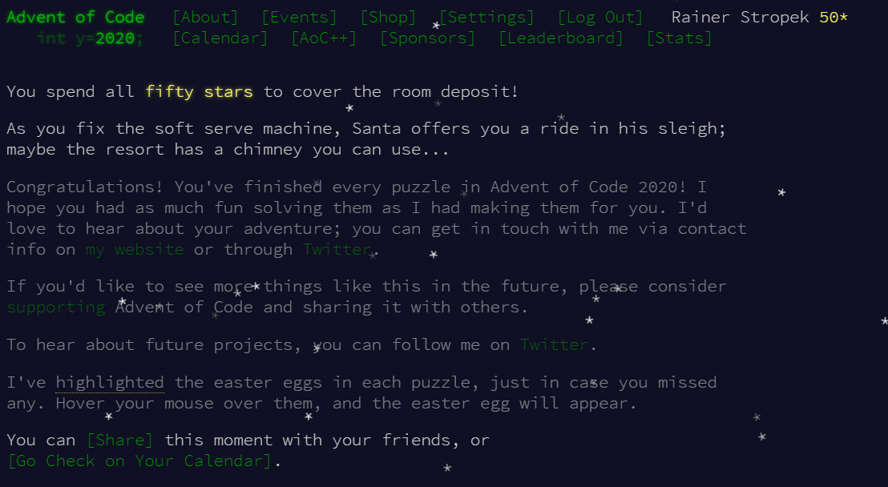

# Advent of Code 2020

My C# solutions for [Advent of Code 2020](https://adventofcode.com/).

This year, we met every day in December with young coders from [CoderDojo Linz](https://linz.coderdojo.net). Together, we solved the programming quizzes of AoC. We had a lot of fun solving the problems. Thank you [Eric Wastl](http://was.tl/) for putting together this great project!

**NOTE** that you have to replace my data (*data.txt* files in each day) with your data from the *Advent of Code* website. Otherwise, you will get my results which will not fit to your test data.
